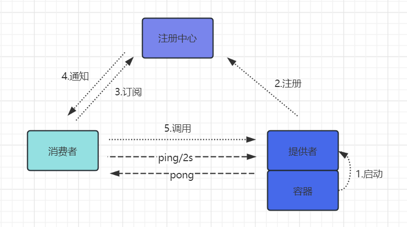

# hangu-rpc

#### 介绍

该框架为rpc原理学习者提供一个思路，一个非常简单的轻量级rpc代码示例，
代码中没有使用什么高级的设计（比如SPI），也没有高级的用法，
服务的调用直接用的反射，没有像dubbo一样，使用字节码生成直接调用代码来提高性能，
注册中心只实现了redis哨兵版本，原因只是因为大部分学习者所在的公司基本都有redis，但zookeeper可能没有，直接拉下来启动即可，
都不需要自己搭建redis。
如果你是一个对rpc原理好奇的人，你可以很快了解rpc的核心实现，至于想要了解更高级的设计，可以阅读dubbo源码。

hangu 是函谷的拼音（原谅我这个九年义务教育漏网之鱼，有些地方拼音打错了，han 写成了 hang）。
为什么取这个名字呢？因为有一次和朋友聊天，聊到了《将夜》，说大师兄和余帘骑着一头牛进了一个叫函谷的地方，
于是道德经就出现了。所以我希望每个进入函谷的人，都能写出自己的道德经。

#### 软件架构

从架构图中可以看到，心跳由消费者主动发起，默认每隔2s向服务提供者发送心跳包，心跳的实现很简单，在消费者这边
使用 Netty 提供的 IdleStateHandler 事件处理器，在每隔2s发起读超时事件时向提供者发送心跳，超过3次未收到
提供者的响应即认为需要重连

#### 快速启动

hangu-demo里有两个子模块，分别是提供者和消费者，启动这两个模块，调用UserController的测试代码即可

